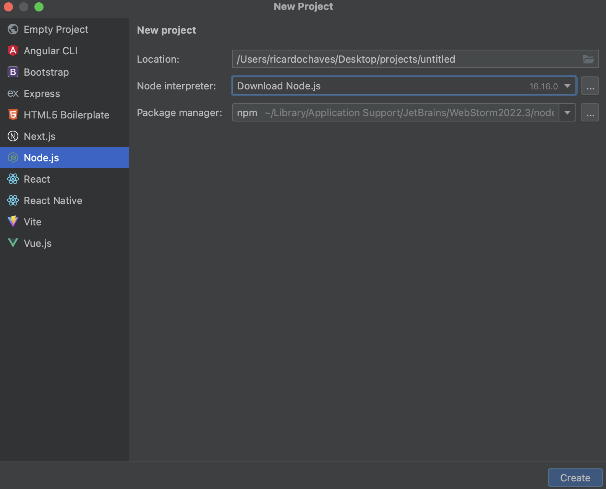
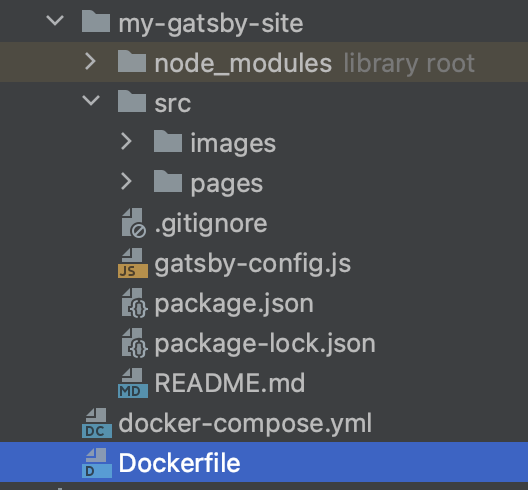
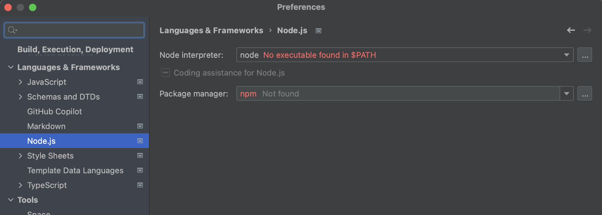
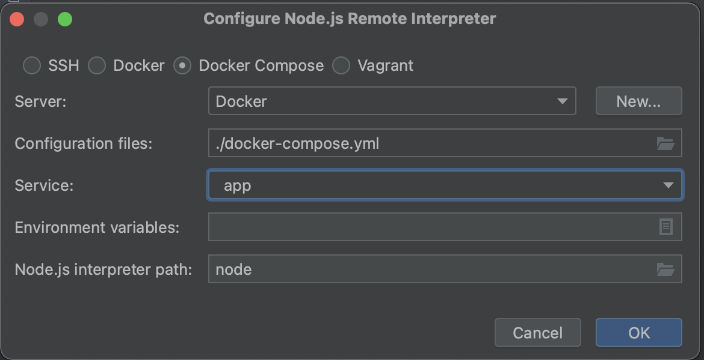
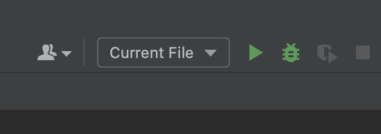
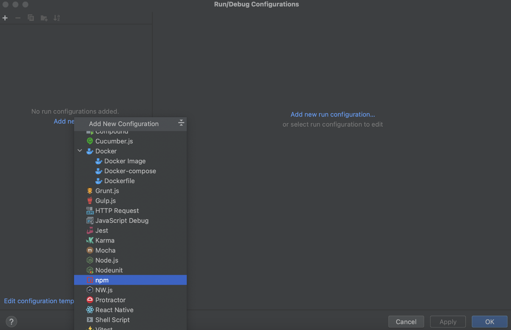
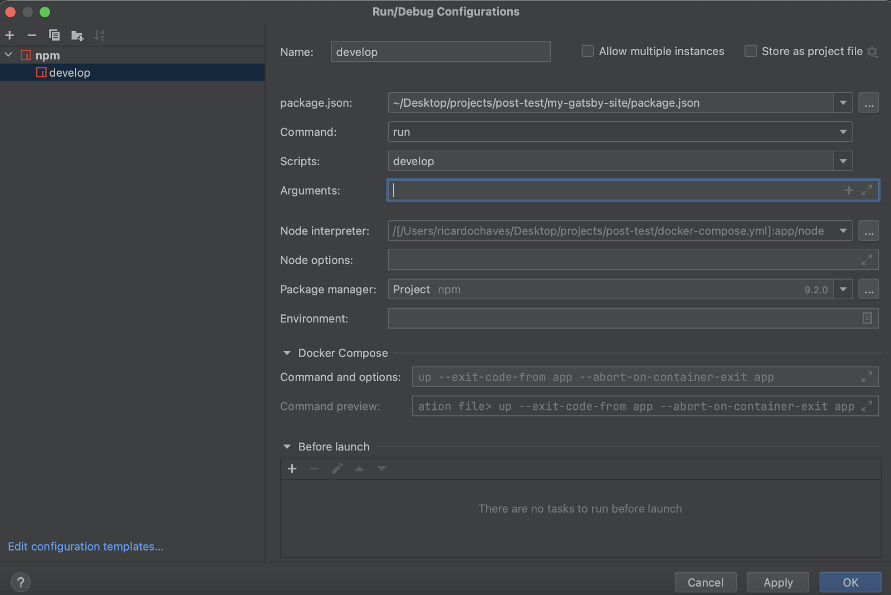
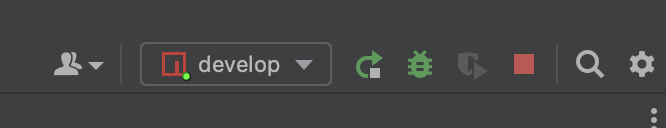
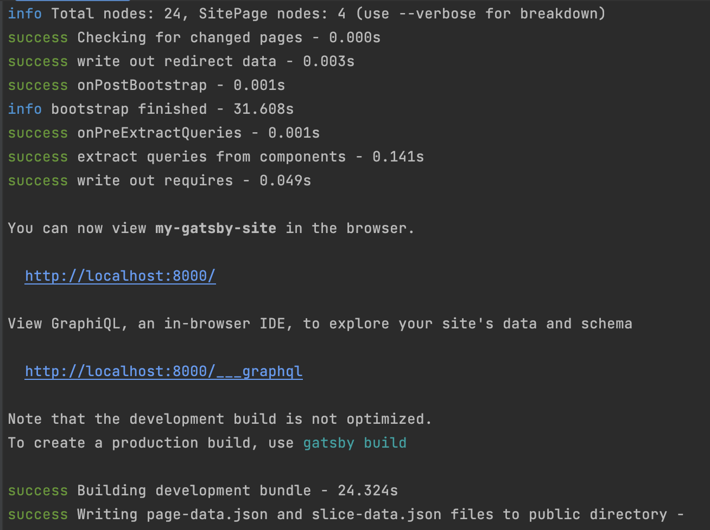
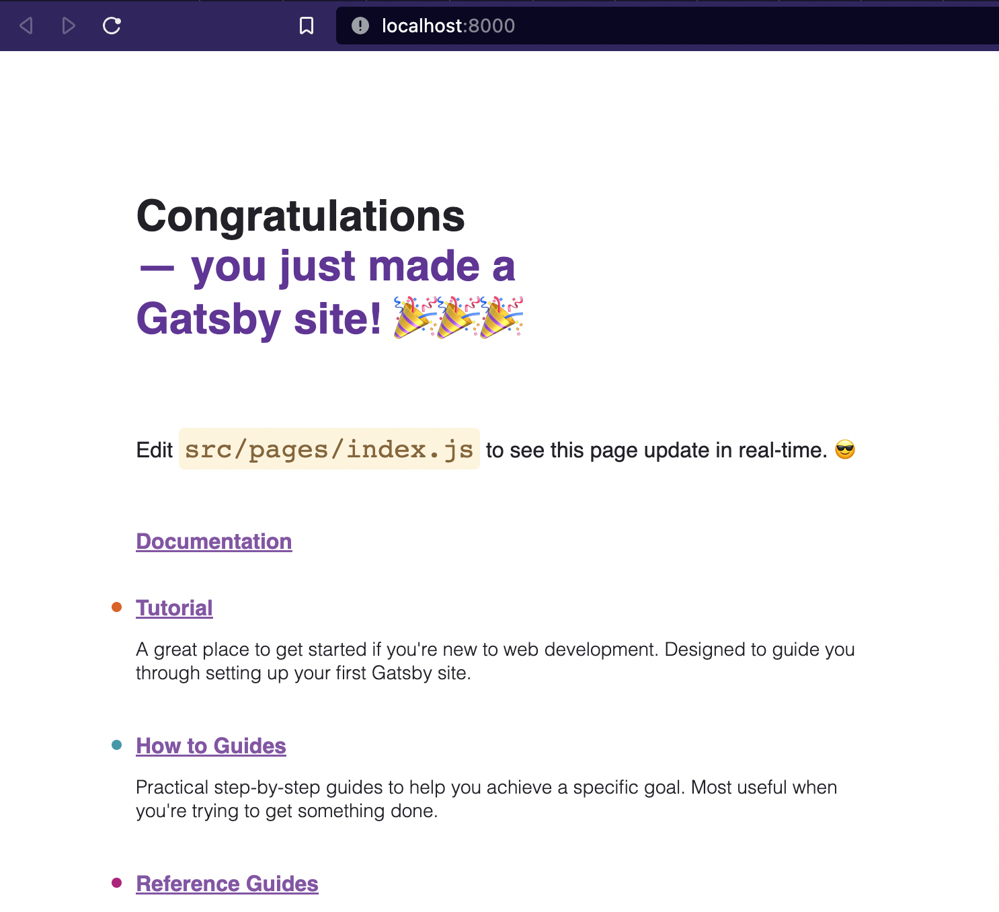

A developer, first of all, is a professional. A professional is someone who can sell a skill to someone else.

When you start to work, one of the first things you have in mind is: "How can I earn more money?". The answer is simple, improve your skills.

We are a select category in many ways, and we have a lot of tools to use today.

This article will teach us how to configure um remote interpreter no WebStorm. On IDE from JetBrains.

# Remote Interpreter
An IDE does not exist alone in your system. Visual Studio or Rider needs an installation of C# in your machine, PyCharm needs Python, WebStorm requires npm, and so on. They usually will install all dependencies in the same installation. Look at this image where WebStorm says it will download npm when I call for a new project.

[//]: # (<h1>{props.pageContext.frontmatter.title}</h1>)

<br/>
The point is when you will work for a company, and you need to work on many different projects simultaneously. You will need to have a lot of different versions of Python, npm, C#, and things like pyenv and nvm start to show up to help.

And well... That's work. The problem is that at a certain point, you will need so many versions that may not even be supported by your OS anymore. Or even fill your machine with so much stuff that it makes it unusable. How have you never installed a package without <code>--dev</code> or done a <code>pip install</code> in the wrong place? Putting things where they shouldn't be, I doubt you will go there and remove them.

The remote interpreter is nothing more than having the environment for that specific project run on another computer. Leaving your local machine with no installation beyond what is necessary to run your IDE.

Most IDEs have support for a remote interpreter. VSCode has it too. The difference between them is the way to configure.

We will use Docker how a remote computer and every project will have a <code>docker-compose.yml</code> in the root, something like this:

```yml
version: "3.7"
services:
  db:
    image: postgres:10.1-alpine
  web:
    build: .
    depends_on:
      - db
    command: ["./start.sh"]
```

Once you clone your project and configure the remote interpreter to use a Docker in a <code>web</code> container, the IDE will be able to run everything. Unit Test, Debug your project, including using a database on a remote computer.

Now let's go to the practice. Remember that I'm writing this in December of 2022. In the future, the prints can be outdated. So, it's essential that you understand the concept and not just copy and paste the example.

# Setup WebStorm

If you wanna see a function example, visit the repository of my blog; this is built with Gatsby, and to create, I didn't install the npm in my MAC.

We will create a new Gatsby project for this example.

The first thing that you need is two files in the directory where you will create a project:

Dockerfile:
```dockerfile
FROM node:19-alpine3.16

RUN npm install -g gatsby-cli@5.2.0

RUN apk update
RUN apk add --update --repository https://dl-3.alpinelinux.org/alpine/edge/testing vips-tools vips-dev fftw-dev gcc g++ make libc6-compat
RUN apk add git
RUN apk add --update --no-cache python3
RUN rm -rf /var/cache/apk/*

WORKDIR /app

COPY . .
```

docker-compose.yml:
```yml
version: "3.8"
services:
  app:
    build: .
    volumes:
      - .:/app
    ports:
      - "8000:8000"
    command:
      [
        "npm", "run", "develop"
      ]
```

Now you execute <code>docker compose run --rm app npm init gatsby</code>. They will build a new docker image and request the information to create a new project after that. In the end, you will see something like that:


With docker, you can create a new project without installing anything on your machine.

Open the directory with WebStorm. Go to settings and search for Node.js configuration. You will see an error in the Node Interpreter configuration.


It is because you don't have a node installed on your machine. Let's create a remote interpreter now.

Open an interpreter's combo box, click add a new interpreter, and select remote. In the new windows, select Docker Compose, and in the compo box Service, select "app." The <code>app</code> is the name of the service that we used in <code>docker-compose.yml</code> before.


Select Ok and Ok again.

Now let's put the project to run. Click in Current File:


Edit Configuration, add new and select npm:


Configure what is needed to run a Gatsby project as if it were locally:


Select Ok and push Play:


Now you have your project running:


Try open <code>http://localhost:8000/ </code>, and you will get an error: <code>localhost didn't send any data</code>. Now we have a remote interpreter's first particularity when running a project with npm. You need an explicit configuration for they need to respond in a host <code>0.0.0.0</code>. Just configure your <code>package.json</code> like that:
```json
"scripts": {
    "develop": "gatsby develop -H 0.0.0.0",
    "start": "gatsby develop",
    "build": "gatsby build",
    "serve": "gatsby serve",
    "clean": "gatsby clean"
  }
```

Just play again and try the same address:


Done. You have your project running on your machine. You can debug and run your tests; everything will be inside your container.

Once that's in git, it's enough for another developer to do the <code>git clone</code>, configure the remote interpreter, and work, without having to install absolutely anything locally.
